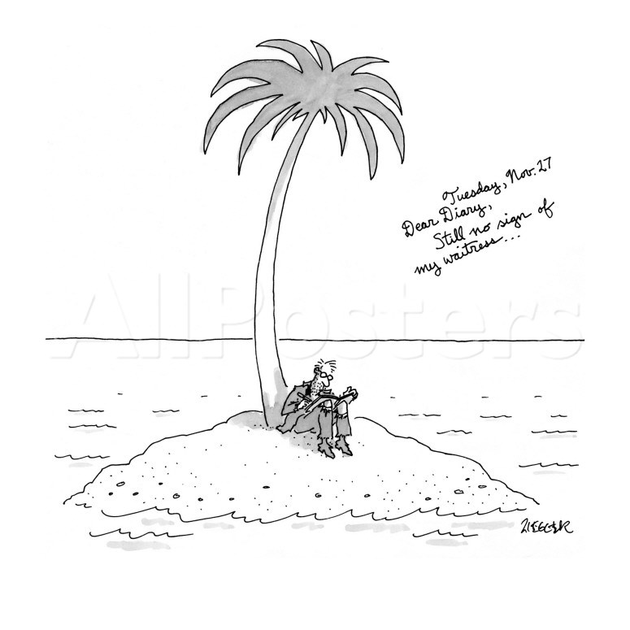
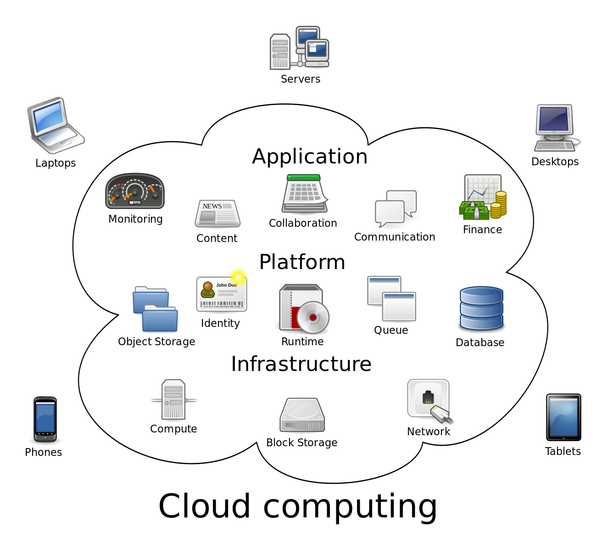

# Web API's: Gluing the modern web together
#### @benzittlau
#### http://github.com/benzittlau
#### http://benzittlau.com
#### http://springlaunched.com
#### http://zittlau.ca
#### ben@getjobber.com

# THE PLAN
10 minutes - I talk at you

5 minutes - Some tech setup

15 minutes - You integrate Twilio's API

15 minutes - You integrate GitHub's API

15 minutes - We glue those integrations together

# DEPENDENCIES
A python environment with PIP

A text editor

Ability to clone a GitHub repo

# THE I TALK AT YOU PART

# SOME DE-ACRONYMIZATION

# WHAT IS AN API?

# API

# APPLICATION

# PROGRAMMING

# INTERFACE

Note:
Three parts here, application, programming, and interface.
Application is obvious, what else would we be integrating?
Programming is obvious, what are we going to do, throw tomato's at GitHub?
So really what we're talkin about is an *interface*

# API

# APPLICATION <!-- .element: class="strike" -->

# PROGRAMMING <!-- .element: class="strike" -->

# INTERFACE

Note:
API's come in many forms, and for many things.  Talking to a chip over wires is talking through an API.  Talking to an operating system like Windows, iOS, or Android happens through API's.
API's let us do two things:
* Ask questions to other systems
* Send commands to other systems

# WHAT IS AN SDK?

# SDK

# SOFTWARE

# DEVELOPMENT

# KIT

Note:
SDK is any kind of "kit" put out to help you develop some "software".
Ranges from a full fledged IDE (Android Studio or Xcode) to a simple library for an API.
This just means "any tools put out by the provider to help you build against them"

# SO WHY WEB API'S?

# THE CLOUD

# BEFORE (~ < 2009)

Note:
Before the cloud each application was effectively it's own lonely island, and had to operate independently.

# AFTER (~ > 2009)

By Sam Johnston [CC BY-SA 3.0 (http://creativecommons.org/licenses/by-sa/3.0)], via Wikimedia Commons

Note:
With the cloud each application is now part of a rich ecosystem.  Applications are constantly passing information and actions back and forth through each other.

# OPERATIONAL STUFF
Email

Tickets

Database

Infrastructure

Monitoring

# FUNCTIONAL STUFF
Build a time tracking app and integrate with QuickBooks for finances and payroll.

Build a to do list and integrate with Google calendar for reminders.

Build a geocaching app and integrate with Google maps for visualizing your maps.

Note:
You can now build an application and only focus on what is the core of what you do well.  For everything else integrate into someone else who does *that* well. (or let your users do it by exposing your own API)

# The Modern Web Application
A large part of building any modern web application will be integrating into other cloud based services, most likely through Web API's.

# So let's stop talking and start doing already!

## Some projects will give you this for free
[Ember Data](https://github.com/emberjs/data)

## Libraries
### Ruby
Sinatra

HTTParty

### JS
Handlebars

Lodash

JQuery

Twitter Bootstrap

## Source
[https://github.com/benzittlau/twitter_caching](https://github.com/benzittlau/twitter_caching)

## What do we need to start caching?

## Identifiers and Payloads
Most caching sytems are "key value stores"

They need a key, and something to store

## Mirroring HTTP
"Uniform resource identifier" (a key)

The returned body is a that resources payload

## Building in model awareness

## Learning about tweets
By making our caching aware of our data model we can improve efficiency.

This comes at a cost of complexity and cache "bleed" into our app.

## Building in persistence

## HTML5 Local Storage
Local storage persists accross reloads

This can be a good thing, but....

## Building in expiration

## We need a way to ignore 'stale' data
There are many strategies to invalid cache

"Time To Live" is a quick and easy one

# Sample image slide

