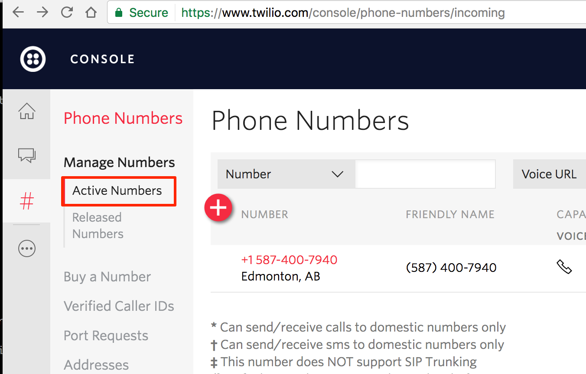
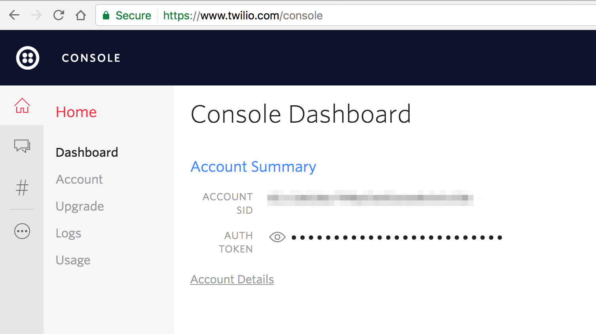
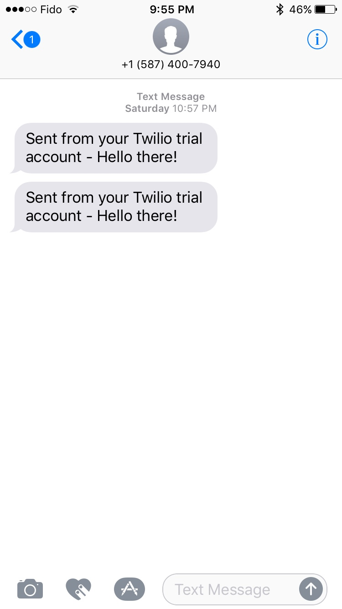
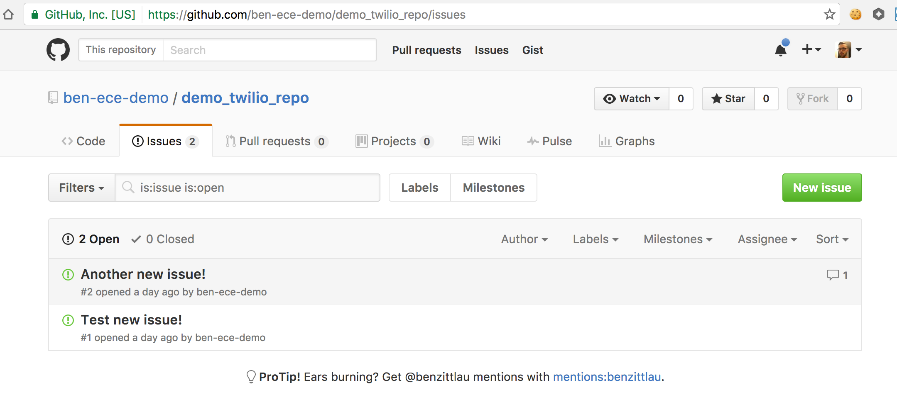
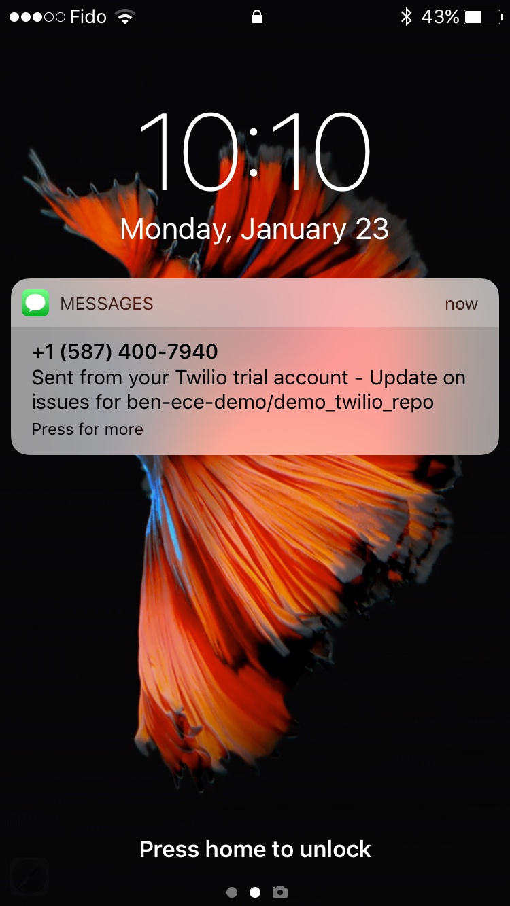

# Web API's: Gluing the modern web together
#### @benzittlau
#### http://github.com/benzittlau
#### http://benzittlau.com
#### http://springlaunched.com
#### http://zittlau.ca
#### ben@getjobber.com


# THE PLAN
10 minutes - I talk at you

5 minutes - Some tech setup

15 minutes - You integrate Twilio's API

15 minutes - You integrate GitHub's API

15 minutes - We glue those integrations together


# DEPENDENCIES
A python environment with PIP

A text editor

Ability to clone a GitHub repo


# THE I TALK AT YOU PART


# SOME DE-ACRONYMIZATION


# WHAT IS AN API?


# API

# APPLICATION

# PROGRAMMING

# INTERFACE

Note:
Three parts here, application, programming, and interface.
Application is obvious, what else would we be integrating?
Programming is obvious, what are we going to do, throw tomato's at GitHub?
So really what we're talkin about is an *interface*


# API

# APPLICATION <!-- .element: class="strike" -->

# PROGRAMMING <!-- .element: class="strike" -->

# INTERFACE

Note:
API's come in many forms, and for many things.  Talking to a chip over wires is talking through an API.  Talking to an operating system like Windows, iOS, or Android happens through API's.
API's let us do two things:
* Ask questions to other systems
* Send commands to other systems


# WHAT IS AN SDK?


# SDK

# SOFTWARE

# DEVELOPMENT

# KIT

Note:
SDK is any kind of "kit" put out to help you develop some "software".
Ranges from a full fledged IDE (Android Studio or Xcode) to a simple library for an API.
This just means "any tools put out by the provider to help you build against them"


# SO WHY WEB API'S?


# THE CLOUD


# BEFORE (~ < 2009)


Note:
Before the cloud each application was effectively it's own lonely island, and had to operate independently.


# AFTER (~ > 2009)

By Sam Johnston [CC BY-SA 3.0 (http://creativecommons.org/licenses/by-sa/3.0)], via Wikimedia Commons

Note:
With the cloud each application is now part of a rich ecosystem.  Applications are constantly passing information and actions back and forth through each other.


# OPERATIONAL STUFF
Email

Tickets

Database

Infrastructure

Monitoring


# FUNCTIONAL STUFF
Build a time tracking app and integrate with QuickBooks for finances and payroll.

Build a to do list and integrate with Google calendar for reminders.

Build a geocaching app and integrate with Google maps for visualizing your maps.

Note:
You can now build an application and only focus on what is the core of what you do well.  For everything else integrate into someone else who does *that* well. (or let your users do it by exposing your own API)


# The Modern Web Application
A large part of building any modern web application will be integrating into other cloud based services, most likely through Web API's.


# So let's stop talking and start doing already!


# Some Tech Setup


# If you're missing things...
If you're missing some tech (like python, etc.) let me get everyone else going and then I'll help you get setup.


# The Goal
We're going to work on an app.

We want to get SMS messages when a GitHub issue gets updated.

It's going to combine GitHub and Twilio.


# The Repo
I've built out the scaffolding for this.

We'll fill in the gaps together.

https://github.com/benzittlau/eceweek-2017-api-workshop-code


# .env File
Copy .env.sample to .env

This is where you'll put all your secrets

NOT IN YOUR CODE


# requirements.txt
```
pip install -r requirements.txt
```


# run.py
Where the magic happens

```python
    #>>>>>>>>>>> YOUR CODE STARTS HERE

    #<<<<<<<<<<< YOUR CODE ENDS HERE
```

Three of these blocks you'll be filling in


# If you get ahead....
Keep going!

Follow the slides, do the next things

If you get to the end there's some challenges


# INTEGRATE TWILIO


# We need some info
.env
```
# TWILIO
TWILIO_ACCOUNT_SID=
TWILIO_AUTH_TOKEN=
MY_PHONE_NUMBER=
TWILIO_PHONE_NUMBER=
```


# Sign up for a trial Twilio account
It's free during trial!

https://www.twilio.com/try-twilio


# Setup a "from" number with Twilio
https://www.twilio.com/console/phone-numbers/incoming



# Get your API credentials
https://twilio.com/user/account



# Write some code
Read the docs:

http://twilio-python.readthedocs.io/en/latest/usage/messages.html

``` python
# This method will need to take a message argument, and send that
# message to the correct phone number, from our twilio phone number.
# Docs on sending a message with the twilio client:
# http://twilio-python.readthedocs.io/en/latest/usage/messages.html
def send_message(message):
    #>>>>>>>>>>> YOUR CODE STARTS HERE

    #<<<<<<<<<<< YOUR CODE ENDS HERE
```


# 10 minutes
Then you can copy my answer


# Your goal



# INTEGRATE GITHUB


# We need some info
.env
```
GITHUB_USERNAME=
GITHUB_PASSWORD=
GITHUB_REPO_NAME=ben-ece-demo/demo_twilio_repo
```


# Signup for a GitHub account
(If you don't already have one)

https://github.com/join


# Write some code
This one will be harder!

Read your docs!

```python
# This method will need to do three things:
# 1. Fetch the repo object
# 2. Fetch the issues on that repo
# 3. Find the timestamp for the most recently modified issue
# Docs on fetching a repo:
# http://pygithub.readthedocs.io/en/latest/github.html#github.MainClass.Github.get_repo
# Docs on fetching issues from a repo:
# http://pygithub.readthedocs.io/en/latest/github_objects/Repository.html#github.Repository.Repository.get_issues
# Docs about the issue object:
# http://pygithub.readthedocs.io/en/latest/github_objects/Issue.html
def get_most_recent_issue_timestamp():
    #>>>>>>>>>>> YOUR CODE STARTS HERE

    #<<<<<<<<<<< YOUR CODE ENDS HERE
```


# 10 minutes
Then you can copy my answer


# Your goal
Know when any updates happen here:



# GLUE THAT STUFF TOGETHER!


# Write our "main loop"
Final exam!
``` python
# This loop will need to do the following:
# - Get the latest timestamp from timestamp from GitHub
# - If it's changed, send an SMS through Twilio
# - Rinse, Repeat
while True:
    #>>>>>>>>>>> YOUR CODE STARTS HERE

    #<<<<<<<<<<< YOUR CODE ENDS HERE
    time.sleep(15)
```


# 10 minutes
Then you can copy my answer


# Your goal
Know when any updates happen here:



# CHALLENGES
For the keeners in class


# Pull Request Support
Send a different message when a pull request on the same repo gets updated


# Optimize your GitHub API usage
Optimizing API usage is an important skill

Look for opportunities with things like sort, limit, filters, etc.


# Do it the hard way
SDK's are great, but limit the amount of control you have

Implement one of the API's directly using a library like requests:

https://pypi.python.org/pypi/requests

Twilio: https://www.twilio.com/docs/api/rest

GitHub: https://developer.github.com/v3/


# Push instead of Pull
GitHub offers webhooks, think about how you could use them instead

https://developer.github.com/webhooks/


# THANK YOU!
Thank you for your time, attention, and effort

@benzittlau

ben@getjobber.com
